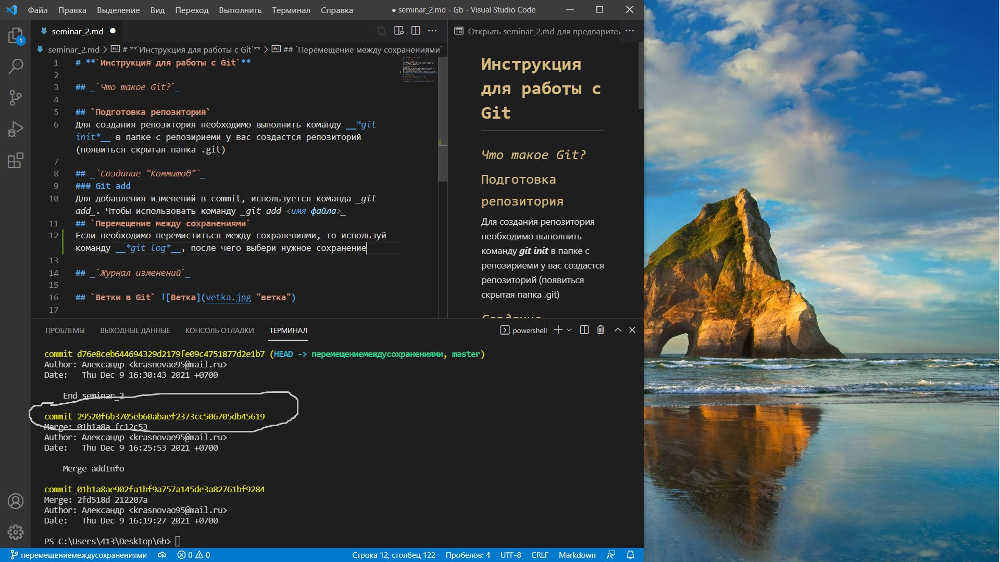

# **`Инструкция для работы с Git`**

## _`Что такое Git?`_

## `Подготовка репозитория`
Для создания репозитория необходимо выполнить команду __*git init*__ в папке с репозириеми у вас создастся репозиторий (появиться скрытая папка .git)

## _`Создание "Коммитов"`_
### Git add
Для добавления изменений в commit, используется команда _git add_. Чтобы использовать команду _git add <имя файла>_
## `Перемещение между сохранениями`
Если необходимо перемиститься между сохранениями, то используй команду __*git log*__, после чего выбери нужное сохранение (коммит)  , и используй комманту **git checkout (ветку в которой ты находишься)** и номер коммита в который нужно перейти.

## _`Журнал изменений`_
Журнал изменений нужен для того чтобы видеть какие изменения были выполнены, когда, какие комментарии были к нему написаны. Чтобы увидеть данную информацию в ветке с которой работаешь нужно написать команду *__git log*__

## `Ветки в Git` 

## _`Слияние веток`_

## `Удаление веток` 