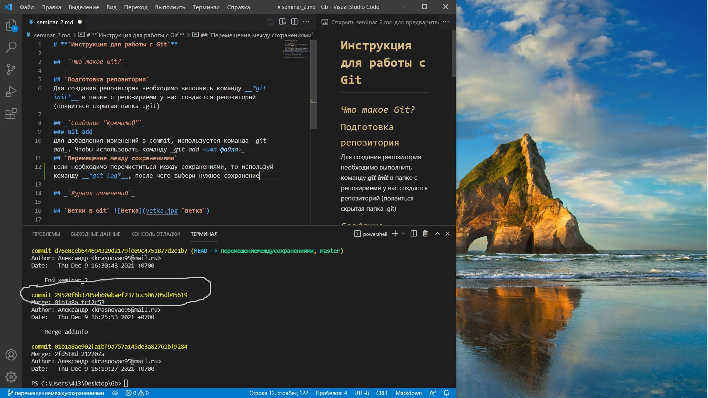

# **`Инструкция для работы с Git`**

## _`Что такое Git?`_

## `Подготовка репозитория`
Для создания репозитория необходимо выполнить команду __*git init*__ в папке с репозириеми у вас создастся репозиторий (появиться скрытая папка .git)

## _`Создание "Коммитов"`_
### Git add
Для добавления изменений в commit, используется команда _git add_. Чтобы использовать команду _git add <имя файла>_
## `Перемещение между сохранениями`
Если необходимо перемиститься между сохранениями, то используй команду __*git log*__, после чего выбери нужное сохранение (коммит)  , и используй комманду **git checkout и номер коммита в который нужно перейти**.

## _`Журнал изменений`_
Журнал изменений нужен для того чтобы видеть какие изменения были выполнены, когда, какие комментарии были к нему написаны. Чтобы увидеть данную информацию в ветке с которой работаешь нужно написать команду *__git log__*

## `Ветки в Git` 
Если несколько людей работают в одном файле над разными частями этого фала, то для удобства необходимо использовать так называемые ветки в Git. Для того чтобы создать новую ветку в Git, нужно ввести команду *__git branch название ветки__*. После чего переходи в эту ветку команндой *__git checkout название ветки__* и работай в ней. Пока ты находишься в этой ветки, все изменения котрые ты вносишь, не отразятся в основной документ, до слияния.
## _`Слияние веток`_
Чтобы слить информацию из какой либо ветки в другую необходимо.
 1. Перейти в ветку в которую необходимо слить информацию командой *__git checkout название ветки__* 
 2. В этой ветке написать в терминал команду *__git merge название ветки которую хочешь влить в текущюю ветку__*
 3. Все готово!
 ___
## `Удаление веток` 
Если неоходимо удалить какую-нибудь ветку.
1. Выведи список веток *__git branch__*
2. Запомни название ветки которую нужно удалить
3. Перейди в ветку master командой *__git checkout master__*
4. Введи команду для удаления *__git branch -d название ветки которую хочешь удалить__*.